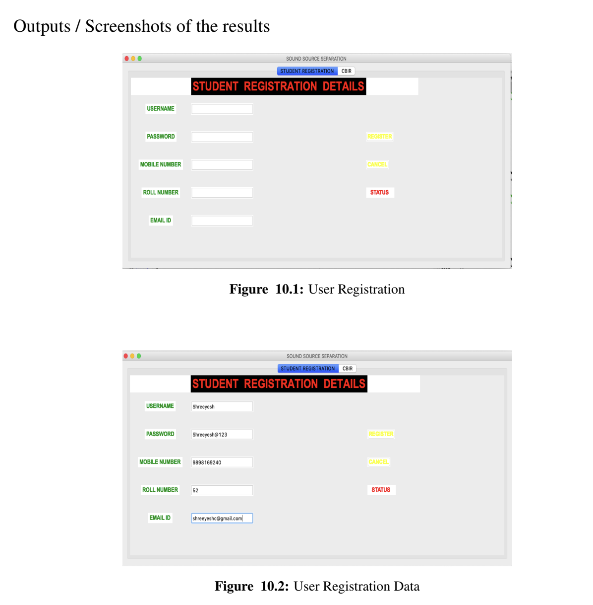
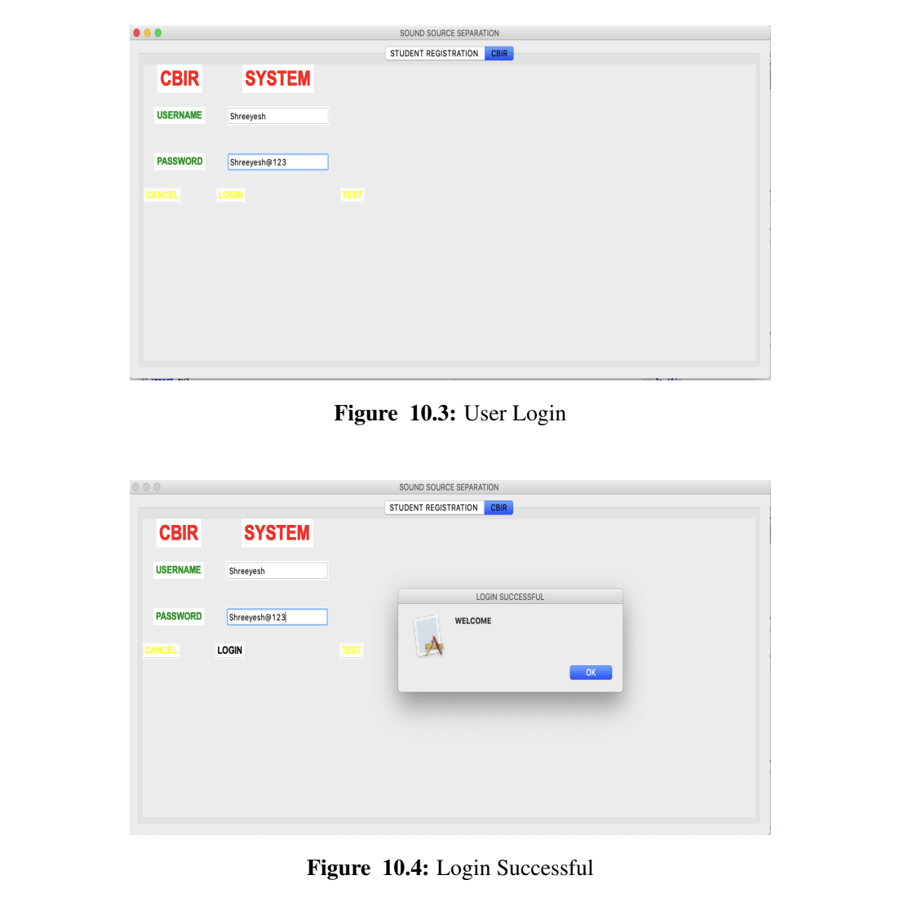
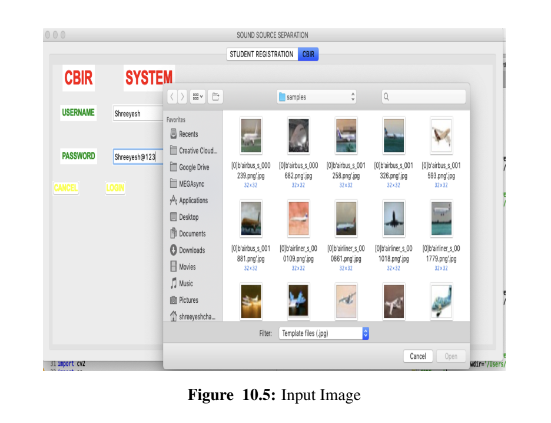
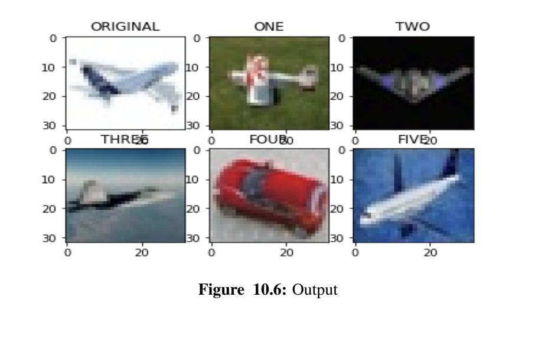

# Bachelors Final Year Project Content Based Image Retrieval
University: School of Computer Engineering and Technology, MITAOE, Pune 15, India

Content-based image recovery (CBIR) is an important and progressively popular approach that supports in the recovery of image data from a large collection. The proposed system consists of feature extraction, image recovery, image comparison
and relevant comments. In our work, we have used the Convolution Neural Network (CNN) for feature representation and to compare similarities. The algorithms used are Discrete Wavelet Transform and Convolution Neural Network have the potential
to perform efficiently in terms of average precision and recall values. The mentioned retrieval algorithm has minimized the computation time and has increased users in- teraction.

This work can be further used in some domain-based applications such as finger print recognition, retina identification, and object detection for large image database. Also the feature extraction in wavelet transform is done sequentially in our project. It can be optimized by using parallel method for feature extraction. Extension for this project can be in Content Based Video Retrieval.

Outcome
• Retrieve image of input image feed to system

Applications
• Crime Prevention: The police use visual information to identify people or to record the scenes of crime for evidence.
• Medical images: Doctors or specialists use CBIR on X-ray, MRI, ultrasound and other medical scanned images.
• Fashion and graphic design: Viewing all previous design photographs, graphics or catalogs.

Content Based Image Retrieval

4.7 Software Resources Required
Platform :Python
1. Operating System: Windows7/8/10, MacOS
2. IDE: Python IDE/ Anaconda
3. Programming Language: Python

Goals and Objectives
The objectives of this study are:
1. To find the attributes of the images using feature extraction.
2. To check the resemblance of the images using a similarity check.

Output Snaps

Journals where this project is published

http://www.rjetm.in/RJETM/Vol02_Issue01/Content%20Based%20Image%20Retrieval%20Using%20Wavelet%20Transform.pdf

http://www.ijrat.org/downloads/Conference_Proceedings/NCRITSI-2K19/NCRITSI2K19-09.pdf

